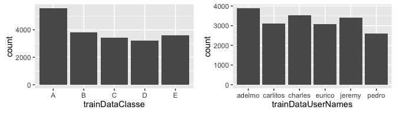
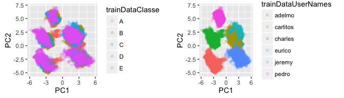
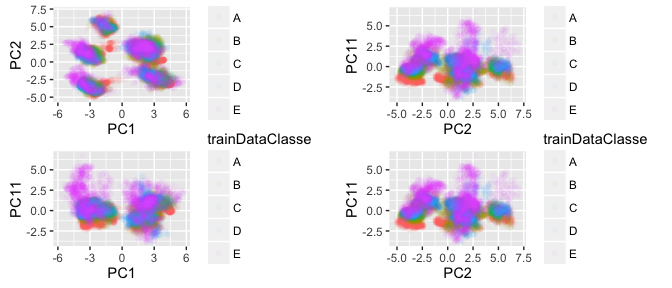

# Practical Machine Learning Assignment
Johan Jordaan  
07/11/2016  


## Executive Summary

I build a model to predict the class type from the available data. The final model has around a 80% accuracy on the cross validation set.

## Overview


## Exploratory Data Analysis
<!-- -->


## Data cleanup and feature reduction

```
## [1] "skewness_yaw_belt"     "var_pitch_belt"        "skewness_yaw_dumbbell"
## [4] "kurtosis_yaw_forearm"  "min_roll_dumbbell"     "skewness_roll_arm"
```

## Outlier analysis

1391 5 0.0708898


## PCA Analsysis
<!-- -->


<!-- -->


```
## Created from 18231 samples and 53 variables
## 
## Pre-processing:
##   - centered (53)
##   - ignored (0)
##   - principal component signal extraction (53)
##   - scaled (53)
## 
## PCA needed 27 components to capture 95 percent of the variance
```

## Looking at the PCA components 
<!-- -->


## Model Building

```
## Loading required package: randomForest
```

```
## randomForest 4.6-12
```

```
## Type rfNews() to see new features/changes/bug fixes.
```

```
## 
## Attaching package: 'randomForest'
```

```
## The following object is masked from 'package:gridExtra':
## 
##     combine
```

```
## The following object is masked from 'package:ggplot2':
## 
##     margin
```

```
## rf variable importance
## 
##   only 20 most important variables shown (out of 27)
## 
##      Overall
## PC22  1101.3
## PC17   950.9
## PC11   950.2
## PC7    744.8
## PC13   687.0
## PC3    652.6
## PC16   606.6
## PC1    571.5
## PC18   556.7
## PC4    554.5
## PC6    531.0
## PC5    522.1
## PC10   512.4
## PC19   502.2
## PC2    497.9
## PC14   483.2
## PC20   477.4
## PC26   427.6
## PC8    415.7
## PC9    389.2
```

```
## Cross-Validated (2 fold, repeated 1 times) Confusion Matrix 
## 
## (entries are percentual average cell counts across resamples)
##  
##           Reference
## Prediction    A    B    C    D    E
##          A 30.1  0.3  0.0  0.0  0.0
##          B  0.0 18.6  0.2  0.0  0.0
##          C  0.0  0.2 18.0  0.4  0.0
##          D  0.0  0.0  0.1 14.9  0.1
##          E  0.0  0.0  0.0  0.1 16.9
##                            
##  Accuracy (average) : 0.985
```


## Test Data
```{r test_data_run
  testData <- fread("pml-testing.csv")
  testDataUserNames <- testData$user_name
  classeIndex <- which(names(testData)=="problem_id")
  testData <- testData[,-c(1:6,classeIndex),with=F]
  testData <- testData[,lapply(.SD,cleanData)]
  testDataNearZeroVarCols = which(names(testData) %in% nearZeroVarColsRemoved)
  testData <- data.table(data.frame(testData)[, -(testDataNearZeroVarCols)])

  
  #testData <- testData[,lapply(.SD,function(x){centerByUser(x,testDataUserNames); })]
  
  
  #testDataPCA <- predict(preprocessParams, testData)


  
  
}

## Results


## Future Work

## Notes


