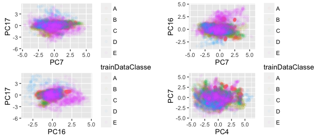

# Practical Machine Learning Assignment
Johan Jordaan  
07/11/2016  


## Executive Summary

I built a model to predict how an individual does excersise based on a range of input factors. I built a decision tree using the random forest model and it has an expected out of sample accuracy of around 96%. This was validated using repeated cross validation or repeated k-folds. The model gave a 100% result on the test data as validated by the post assignment quiz.  


## Data Cleanup

The following columns were removed from the training data because I judged them to not contribute to the prediction: V1, user_name, raw_timestamp_part2, raw_timestamp_part2, cvtd_timestamp, new_window, num_window, classe, problem_id. 

Since all the data is numeric I replaced all empty strings or strings containing "NA" with a proper typed NA. Then I set any values that are NA to zero.

After this, I removed any columns that had zero to a near zero variance. This reduced my training data set to 54 features.

## Outlier analysis

After exploring the data bit I discovered many outliers and made the decision to remove any rows that had a column that had a value that was greater than 5 times the IQR. This process removed 1391 rows or around 0.0708898 of the training data.

## PCA Analsysis
I decided that a PCA analysis of the data was in order and I perforemd one. My main reason was the long model training times on the full set of features. So I used it as a compression step. 


Here are the results of the PCA applied to the training data.

The 54  further reduced to 26. Plotting the most important components (in terms of the final model) allowed me to 'eye-ball' the PCA components and make sure that there were no irregularities. 

<!-- -->

## Model Building

The caret package makes model building very easy. I initally decided to build a decision tree model because the problem is a classification problem and I have had good results with decsion models before. (On a side note I did initially implment a multivariat logist regression (read simple neaural net) and it worked fine but did not use the caret package so i dropped it in favour of the caret aproach to avoid gaving to impiment cross validation myself.). I used repeated 5-fold cross validation with 3 repeats. Below is the final confusion matrix and accuracy stats for the model. 


```
## Cross-Validated (5 fold, repeated 3 times) Confusion Matrix 
## 
## (entries are percentual average cell counts across resamples)
##  
##           Reference
## Prediction    A    B    C    D    E
##          A 30.0  0.4  0.0  0.0  0.0
##          B  0.1 18.5  0.2  0.0  0.1
##          C  0.0  0.3 17.9  0.6  0.1
##          D  0.0  0.0  0.1 14.7  0.1
##          E  0.0  0.0  0.0  0.1 16.7
##                             
##  Accuracy (average) : 0.9786
```

As a side note the model feature selection was a bit different from what the PCA analysis seemed to indicate. 

```
## rf variable importance
## 
##   only 20 most important variables shown (out of 26)
## 
##      Overall
## PC7    762.2
## PC17   745.1
## PC16   699.6
## PC4    656.7
## PC9    653.7
## PC3    652.3
## PC2    651.8
## PC11   633.9
## PC5    617.7
## PC1    604.2
## PC19   596.0
## PC18   592.2
## PC26   590.3
## PC13   572.8
## PC6    552.0
## PC21   548.7
## PC8    514.1
## PC22   505.5
## PC10   498.7
## PC24   474.7
```

## Test Data
The model was applied to the test data after applying the same monupulations to the test data as what was applied to the training data. The resuls are not dipslayed here but provided me with a 100% score on the test data.


